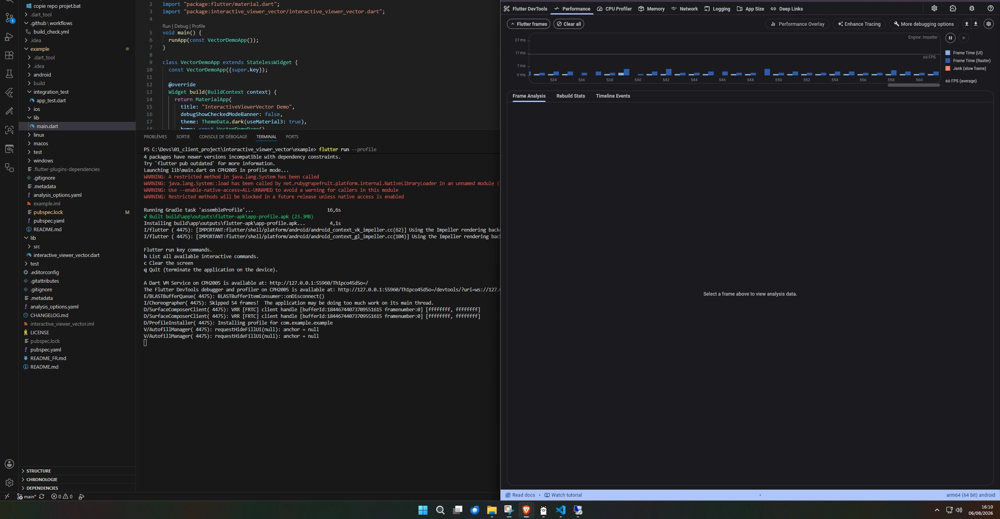

# interactive_viewer_vector — Technical reference

> This is the full technical reference for GitHub. For the pub.dev-friendly version, see [README.md](README.md).
>
> Version française : [README_GH_FR.md](README_GH_FR.md)

A drop-in replacement for Flutter's `InteractiveViewer` that eliminates widget rebuilds during pan and zoom — zero `setState`, zero rebuilds, just paint.

- **pub.dev:** https://pub.dev/packages/interactive_viewer_vector
- **Repository:** https://github.com/Sebastien-VZN/flutter_interactive_viewer_vector

## The problem

When you pan or zoom a standard `InteractiveViewer`, Flutter rebuilds the **entire widget subtree on every single frame** of the gesture. Every `CustomPaint`, every `RepaintBoundary`, every child — all of it is rebuilt and re-laid-out dozens of times per second. On a heavy canvas (a mindmap with hundreds of nodes, a complex editor, a painted dashboard) this rebuild storm shows up as **visible jank and dropped frames on mobile**.

This is a known, long-standing Flutter framework limitation ([#78543](https://github.com/flutter/flutter/issues/78543), [#72066](https://github.com/flutter/flutter/issues/72066), [#118434](https://github.com/flutter/flutter/issues/118434), [#129150](https://github.com/flutter/flutter/issues/129150), [#60550](https://github.com/flutter/flutter/issues/60550)). The stock `InteractiveViewer` subscribes to its `TransformationController` (a `ValueNotifier<Matrix4>`) and calls `setState` on every transformation change. During a pan or pinch zoom, this rebuilds the entire widget subtree on every frame. It has not been fixed upstream because the fix is architectural — the widget would need to be restructured to avoid `setState`.

## The fix

A single method change: `_handleTransformation` no longer calls `setState`. It writes the matrix straight to the `RenderTransform` via a `GlobalKey`, triggering `markNeedsPaint()` only. The widget tree is untouched during interactions.

```
Stock InteractiveViewer:   matrix change -> setState -> build() whole subtree -> layout/paint
InteractiveViewerVector:   matrix change -> RenderTransform.transform = m   -> markNeedsPaint only
```

The API, gesture behavior, and constructor parameters are unchanged.

## Screenshots

| Android | Desktop |
|---|---|
|  |  |

## Real-world result

Validated on an Oppo Find X2 with a complex mindmap canvas: 60fps stable during pan and zoom, matching Mindmeister's performance. The previous LOD (Level of Detail) mitigation that was used to hide jank was removed after this fork made it unnecessary.

## Dead code cleanup: unfinished rotation support

The stock SDK contains unfinished rotation gesture support: a hardcoded `_rotateEnabled = false`, a `_matrixRotate` method, rotation-aware boundary clamping, a `_GestureType.rotate` enum value, and two TODOs referencing [flutter/flutter#57698](https://github.com/flutter/flutter/issues/57698) (open since 2020). This was designed for geographic map use cases. It was never completed upstream and is irrelevant for this package's target use cases (mindmaps, canvases, image viewers). All of this dead code was removed from the fork to simplify the codebase.

## Usage

Replace `InteractiveViewer` with `InteractiveViewerVector` and `TransformationController` with `TransformationControllerVector` — same parameters, same callbacks:

```dart
final _controller = TransformationControllerVector();

InteractiveViewerVector(
  transformationController: _controller,
  constrained: false,
  boundaryMargin: const EdgeInsets.all(2000),
  minScale: 0.1,
  maxScale: 3,
  onInteractionEnd: (details) { /* ... */ },
  child: MyHugeCanvas(),
)
```

Programmatic transforms work as usual:

```dart
_controller.value = Matrix4.identity();
```

All constructor variants are supported: `InteractiveViewerVector(...)`, `InteractiveViewerVector.builder(...)`, `panEnabled`, `scaleEnabled`, `panAxis`, `trackpadScrollCausesScale`, `scaleFactor`, `alignment`, `clipBehavior`, etc.

## Tests

Widget tests assert that a child with a build counter is built **exactly once** across 10 consecutive transformation updates (pan and scale). With the stock widget, each update triggers a build. This test is the proof that the fork works.

```bash
flutter test                              # unit + widget tests
cd example && flutter test integration_test  # integration (device required)
```

The `example/` app displays a live "canvas builds" counter in its app bar: it stays flat while you pan/zoom.

### Real-device performance testing

Automated widget tests prove the no-rebuild guarantee (build count stays at zero), but they don't measure real-world frame timing. To measure actual performance:

**Always test on a physical device in profile mode — never on an emulator.**

```bash
cd example
flutter run --profile -d <device-id>
```

Why this matters:

- **Emulators lie.** Android emulators (x64) run without real GPU drivers and with interop overhead on every native call — pointer events fire at unrealistic rates, `Stopwatch` calls dominate the CPU profile (up to 58% of sampled time), and frame budgets are meaningless. You will see phantom jank that doesn't exist on real hardware.
- **Debug mode masks the problem.** With DevTools attached, the GC pressure from constant `setState`/rebuild cycles in the stock `InteractiveViewer` actually _masks_ the jank by coalescing rebuilds. Profile mode strips this safety net — AOT compilation, no debug hooks, real allocation patterns — and the true cost of rebuilding the subtree on every frame becomes visible.
- **Profile mode + physical device** is the only combination that gives real frame times: real touch sampling rates, real GPU fill rates, real thermal constraints.

Protocol:

1. Connect a physical device: `flutter devices`
2. Run in profile mode: `flutter run --profile -d <device-id>`
3. Open Flutter DevTools → Performance tab
4. Record 3-5 seconds of continuous pan/zoom
5. Check: p50/p95 frame times, % of frames > 16.6 ms (60fps budget), FPS during drag

Expected result — the UI thread stays quiet (no `build()`, no `scheduleBuildFor`), and only the raster thread paints the transformed content:



## Platforms

Native only — CanvasKit/HTML rendering on the web has its own performance characteristics and negates the benefit.

| Platform | Status |
|---|---|
| Android | Manually validated |
| Linux | Manually validated |
| Windows | Manually validated |
| iOS | CI-compiled, no runtime tests |
| macOS | CI-compiled, no runtime tests |

Tested personally on **Android, Linux and Windows** — that's the hardware I have. iOS and macOS compile cleanly on every CI run but I have no devices to runtime-test. If you use them, a one-line "works on my setup" in a [GitHub Issue](https://github.com/Sebastien-VZN/flutter_interactive_viewer_vector/issues) would help harden the support matrix.

## Maintenance & contribution

I'm not a full-time maintainer. I built this fork for my own project ([Axomind](https://github.com/Sebastien-VZN)), where it drives a heavy mindmap canvas, and I publish it in case it's useful to others working on similar interactive canvases.

What that means in practice:

- **Bug reports** — welcome. Open a [GitHub Issue](https://github.com/Sebastien-VZN/flutter_interactive_viewer_vector/issues) with a repro and I'll look into it. Bugs that break the core pan/zoom behavior or regress the no-rebuild guarantee are the priority.
- **Feature requests** — I'll consider them only when they're relevant to my own use case: mindmaps, canvases, and interactive content of that kind. If a requested feature fits that scope, I'm happy to discuss it.
- **Out-of-scope features** — if you need behavior aimed at a different kind of app (geographic maps, document viewers, exotic gesture modes, etc.), the cleanest path is to fork the project. The codebase is small and the fork's single behavioral change is isolated, so adapting it to your needs should be straightforward.

This is a focused fix I use in production, shared publicly. Clear expectations on both sides keep it sustainable.

## Origin & license

Forked from the Flutter SDK (`packages/flutter/lib/src/widgets/interactive_viewer.dart`, 1300+ lines) with a single behavioral change in `_handleTransformation`. BSD 3-Clause license, copyright notice of The Flutter Authors preserved inside [LICENSE](LICENSE).
