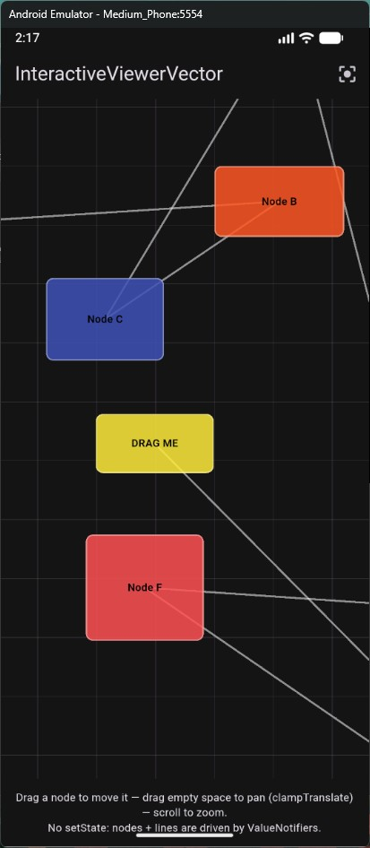
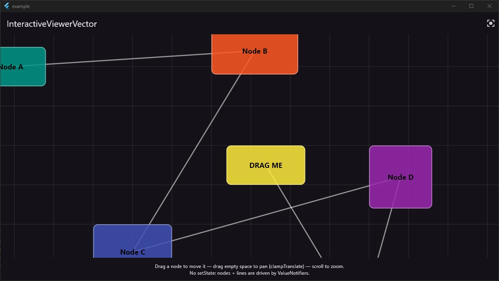

# example — InteractiveViewerVector Demo

Interactive demo app for the `interactive_viewer_vector` package. Displays a draggable node graph on a pannable, zoomable canvas — with zero `setState` during interactions.

## What it shows

- **Draggable nodes** — grab any colored node and move it. Connections update in real time via `ValueNotifier`, no `setState`.
- **Canvas pan** — drag empty space to pan the canvas (custom `clampTranslate` pattern, matching real-world usage in [Axomind](https://github.com/Sebastien-VZN)).
- **Scroll zoom** — mouse wheel or trackpad pinch to zoom.
- **Build counter** — the app bar shows a live "canvas builds" counter that stays flat while you interact, proving the no-rebuild guarantee.

## Screenshots

| Android | Desktop |
|---|---|
|  |  |

## Running the app

```bash
cd example
flutter run
```

For performance testing on a physical device:

```bash
flutter run --profile -d <device-id>
```

See the [performance testing protocol](../README_GH.md#real-device-performance-testing) (EN) or [protocole de test de performance](../README_GH_FR.md#tests-de-performance-sur-appareil-réel) (FR) for the full DevTools profiling guide.

## Architecture

The demo reproduces the pattern used in production apps:

- `TransformationControllerVector` drives pan/zoom
- `ValueNotifier<List<DemoNode>>` drives node positions and connection lines — no `setState` anywhere
- A `Listener` layer on top handles pointer events for both node dragging and canvas panning
- `CustomPaint` layers for the grid and connection lines
